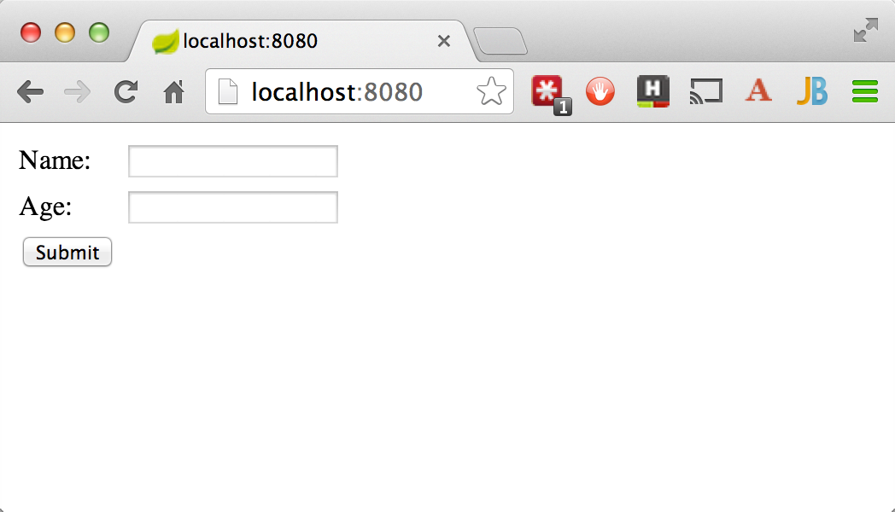
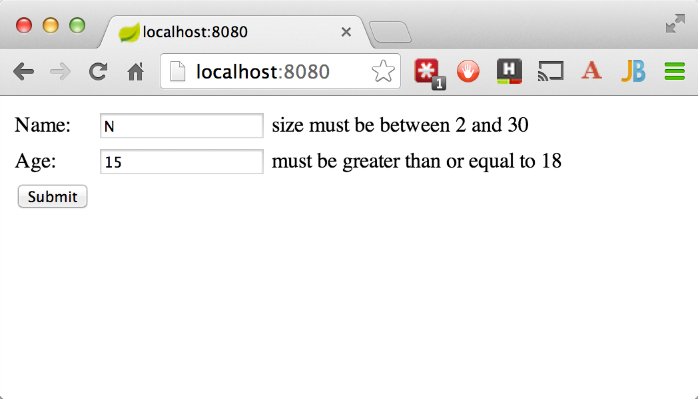

<#assign project_id="gs-validating-form-input">

What you'll build
-----------------

This Getting Started guide walks you through the process of configuring your form to support validation. On top of that, you'll see how to display the error message on the screen so the user can re-enter a valid input.

What you'll need
----------------

 - About 15 minutes
 - <@prereq_editor_jdk_buildtools/>

## <@how_to_complete_this_guide jump_ahead='Creating a Person object'/>

Set up the project
------------------

<@build_system_intro/>

<@create_directory_structure_hello/>

### Create a Maven POM

    <@snippet path="pom.xml" prefix="initial"/>

<@bootstrap_starter_pom_disclaimer/>

Creating a Person object
------------------------
The application involves validating a user's age, so first we need to create a class to represent a person.

    <@snippet path="src/main/java/hello/Person.java" prefix="complete"/>
    
The `Person` class only has one attribute, `age`. It is flagged with standard validation annotations:
- `@NotNull` won't allow an empty value
- `@Min(18)` won't allow if the age is less than 18

In addition to that, you can also see getters/setters for `age` as well as a convenient `toString()` method.

Creating a web controller
-------------------------
Now that we have defined our entity, it's time to create a simple web controller.

    <@snippet path="src/main/java/hello/WebController.java" prefix="complete"/>

This controller has a GET and a POST method, both mapped to `/`. 

The `showForm` method returns the `form` template. It includes a `Person` in it's method signature so the template can associate form attributes with a `Person`.

The `enterAge` method accepts three arguments:
- a `person` object marked up with `@Valid` to gather the attributes filled out in the form we're about to build
- a `bindingResult` object so we can test for and retrieve validation errors 
- a `redirectAttributes` object so we can create a flash-scoped error message to show the user what went wrong in the event of an error.

That way, we can retrieve all the attributes from the form bound to the `Person` object. In the code, we test if there were any errors, and if so, add a flash attribute named `error`, and redirect the user back to the `/` page. If there are no errors, then we return the `results` template.

Building an HTML front end
--------------------------
First of all, we need to build the "main" page.

    <@snippet path="src/main/webapp/form.html" prefix="complete" parse=false/>
  
It contains a simple form with each field in a separate slot of a table. The form is geared to post towards `/enterAge`. It is marked as being backed up by the `person` object that we saw in the GET method in the web controller. This is known as a **bean-backed form**. There is only one field in our `Person` bean, and we can see it tagged with <#noparse>`th:field="*{age}"`</#noparse>.

Right next to that entry field is a `
` with <#noparse>`th:text="${error}"`</#noparse>. This gives us a place to insert an error message.

Finally, we have a button to submit. In general, if the user enters an age that violates the `@Valid` constraints, it will bounce back to this page with the error message on display. If a valid age is entered, then the user is routed to the next web page.

    <@snippet path="src/main/webapp/results.html" prefix="complete" parse=false/>
    
> **Note:** These web pages don't have any sophisticated CSS JavaScript, because we are trying to keep things simple. But for any professional web sites, it's very valuable to learn how to style your web pages.

Configuring the application
---------------------------
For this application, you are using the templating language of [Thymeleaf](http://www.thymeleaf.org/doc/html/Thymeleaf-Spring3.html). This application needs more than raw HTML.

    <@snippet path="src/main/java/hello/Application.java" prefix="complete"/>
    
To activate Spring MVC, you need `@EnableWebMvc` added to the class. It also has `@ComponentScan` to find the annotated `@Controller` class and its methods. To top it off, it uses `@EnableAutoConfiguration` to fire up Spring Boot.

The extra beans shown in this configuration are used to wire up Thymeleaf and integrate it with Spring MVC. The first one takes view names, appends `.html`, and looks for that file in `src/main/webapp/`.  The rest are used to perform proper resolution and rendering.

### <@build_an_executable_jar/>

<@run_the_application_with_maven module="web application"/>

The application should be up and running within a few seconds.

If you visit <http://localhost:8080/>, you should see something like this:

What happens if you enter **15** and click on **Submit**?

Here you can see that because it violated the constraints in the `Person` class, you get bounced back to the "main" page. If you click on submit with nothing in the entry box, you get a different error.

Finally, if you enter a valid age, then you end up on the `results` page!

Summary
-------

Congratulations! You have coded a simple web application with validation built into a domain object. This way you can ensure the data meets certain criteria and leverages the user to input it correctly.
